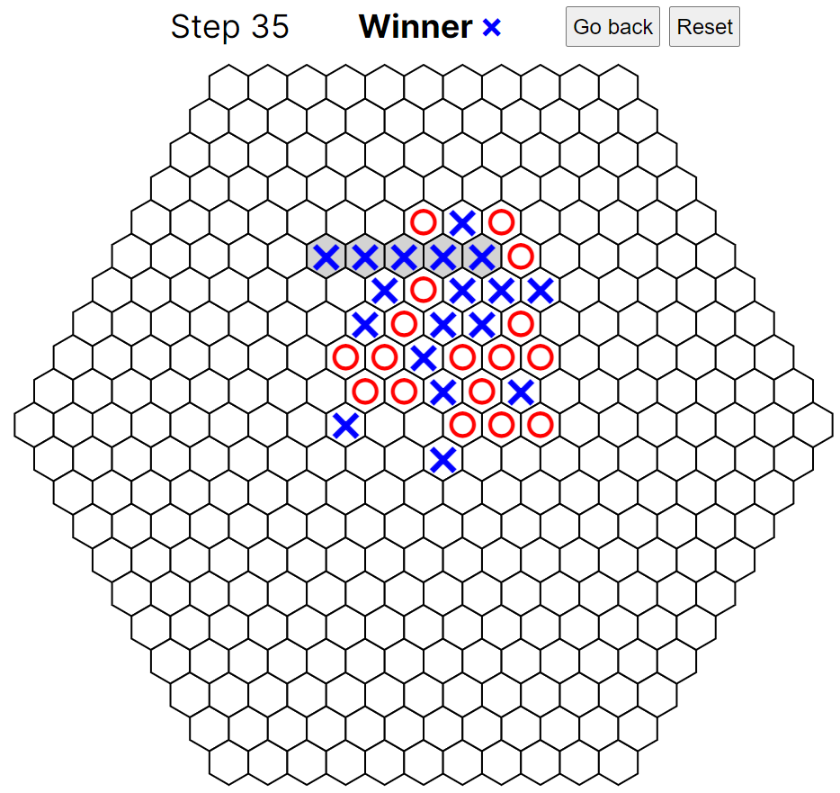

# Hex-Gomoku


[](https://github.com/tomtkg/Hex-Gomoku/actions/workflows/ci.yml)

This is a Gomoku (also called Five in a Row) board game on a hex map.  
A hex map is often called hex board or hex grid.

URL: [https://tomtkg.github.io/Hex-Gomoku](https://tomtkg.github.io/Hex-Gomoku)



## Installation & Startup

```bash
npm install
npm run build
npm start
```

Open [http://localhost:3000](http://localhost:3000) with your browser to see the result.

## Build & Deploy

Use GitHub Actions. Check [.github/workflows/ci.yml](https://github.com/tomtkg/Hex-Gomoku/blob/main/.github/workflows/ci.yml) for details.
